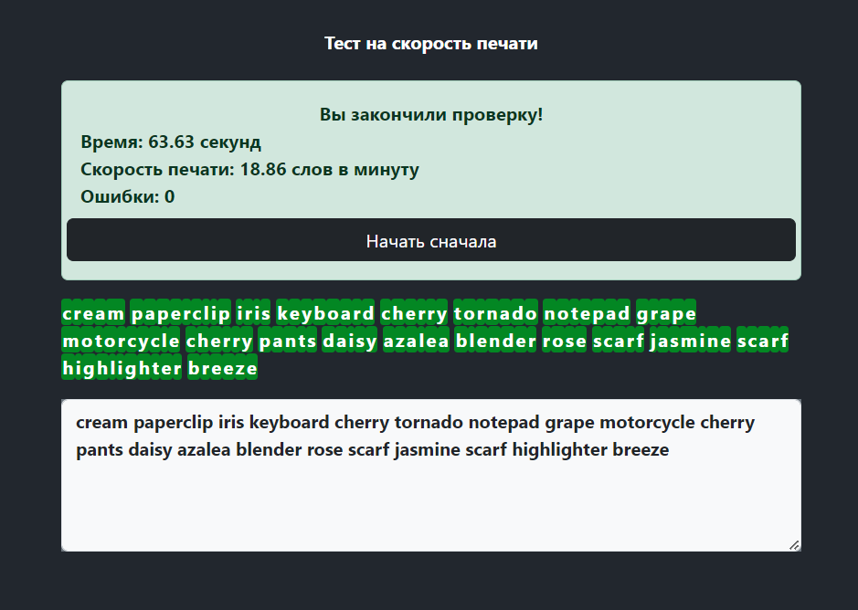

# Тест для poizon-api

## Описание


> Это приложение для тестирования скорости печати. Пользователи могут проверить свою скорость и точность ввода текста. Приложение предоставляет результаты теста, включая скорость печати, количество ошибок и время выполнения.




## Демо

Вы можете посмотреть на этот сайт по ссылке ниже (до 20.8.2024):

http://m94943bj.beget.tech/


## Установка


1. Клонируйте репозиторий:

    ```bash
    git clone https://github.com/Zhedsnake/poizon-api_test
    ```

2. Перейдите в каталог проекта:

    ```bash
    cd client
    ```

3. Установите зависимости:

    ```bash
    npm install
    ```

## Способы запуска локально

### Использование Docker

1. Убедитесь, что Docker установлен и запущен на вашем компьютере.
2. Воспользуйтесь командой:

    ```bash
    docker-compose -f docker-compose.dev.yml up -d
    ```

3. Перейдите в `http://localhost:4000` в вашем веб-браузере.

### Использование Node.js

1. Убедитесь, что Node.js установлен на вашем компьютере.
2. Перейдите в каталог проекта, установите зависимости и запустите проект:

    ```bash
    cd client &&\
   npm i &&\
   npm run dev
    ```

## Использование

1. Перейдите в `http://localhost:3000` в вашем веб-браузере.
2. Введите текст в поле ввода и начните тест.
3. Получите результаты теста по завершению.

## Компоненты

- `App.tsx`: Главный компонент приложения, который инициализирует контекст и Redux.
- `Home.tsx`: Страница и галавный компонент для теста скорости печати.
- `HighlightedText.tsx`: Компонент для выделения введенного текста.
- `Results.tsx`: Компонент для отображения результатов теста.
- `InputWords.tsx`: Компонент для ввода текста пользователем.
- `RestartButton.tsx`: Кнопка для перезапуска теста.

## Стек технологий

- React
- Redux
- TypeScript
- Bootstrap
- React Router

## Контакты

- **Email:** besedinzena5@gmail.com
- **Telegram:** https://t.me/zhedforeigner
- **GitHub:** https://github.com/Zhedsnake
